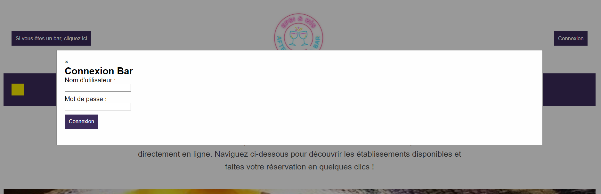
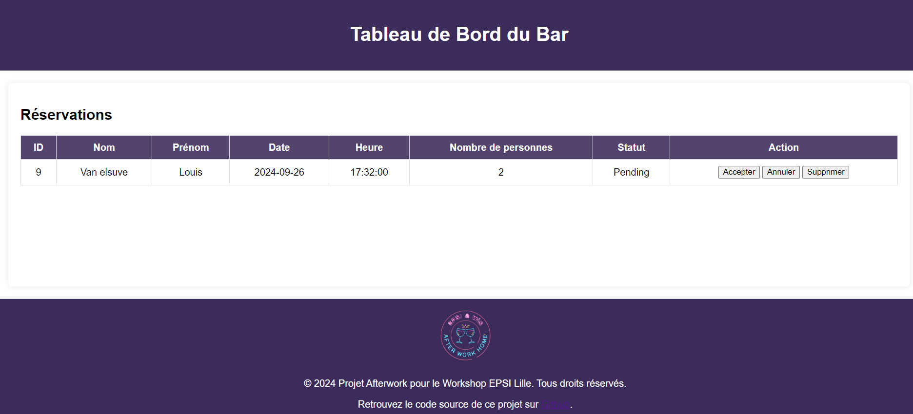

= Guide Utilisation :

:description: 
ifdef::env-vscode,env-gitlab[]
endif::[]
ifdef::env-site[]
include::partial$_attributes.adoc[]
endif::[]

[abstract]
{description}.

== Introduction

Le guide bar permet  d'aider les gerants de bar à comprendre comment utiliser l'outil AfterWork Home efficacement.

Il fournit des instructions claires et détaillées, réduisant les erreurs et les demandes de support.

== Prerequis

Avant d'avancer plus loin, veuillez avoir :

* un accès a internet

* une machine pouvant exploiter internet (pc, tablette ou telephone)

== créer un compte

La creation d'un compte "bar" est reservé à l'administrateur pour limiter la creation abusive de ce type de compte.

Pour être partenaire, veuillez contacter Louis Van Elsuve afin de récupérer votre username et votre mot de passe.

== Connexion 

Après avoir récupérer les accès, un bouton dédié aux bars est disponible en haut à gauche de la page.

== Gestion des reservations

Suite à la connexion du compte Bar, une page dashboard s'ouvre comprennant les différentes réservations associées au bar.

L'utilisateur d'un compte bar peut valider, annuler ou supprimer les reservations envoyé à son etablissement.

