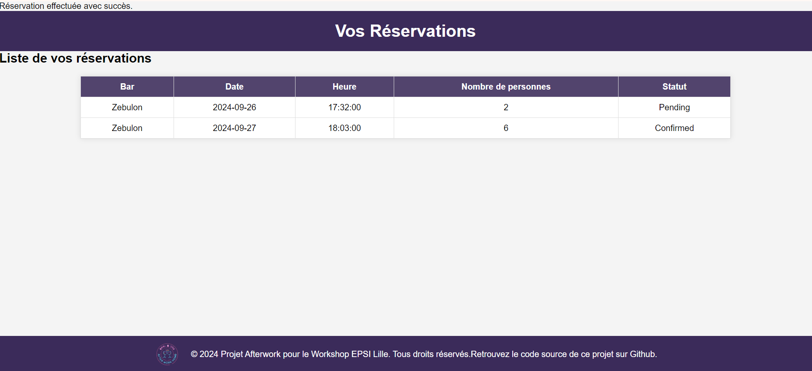

= Guide Utilisation :

:description: 
ifdef::env-vscode,env-gitlab[]
endif::[]
ifdef::env-site[]
include::partial$_attributes.adoc[]
endif::[]

[abstract]
{description}.

== Introduction
Un guide d'utilisation sert à aider les utilisateurs à comprendre comment utiliser un produit ou service efficacement. Il fournit des instructions claires et détaillées, réduisant les erreurs et les demandes de support. Il améliore l'expérience utilisateur, favorise l'autonomie, et contribue à la satisfaction et à la fidélité des clients.

== Prerequis

Avant d'avancer plus loin , veuillez avoir :

* un accès a internet

* une machine pouvant exploiter internet : (pc, tablette et telephone)

== créer un compte

=== Accéder au site AfterWork Home

Ouvrez votre navigateur internet (Google Chrome, Firefox, Safari, etc.). Dans la barre d'adresse, entrer «http://localhost/afterworkproject/afterwork.php» (pour la version locale après importation de la base de données dans PhpMyAdmin) et appuyez sur "Entrée".

 - Sur la page d'accueil du site AfterWork Home, repèrez le bouton "Connexion".

===  Commencer la création de compte

Cliquez sur "Connexion".

Ensuite, choisisez "Créer un compte" dans la fenêtre qui apparaît.

=== Remplir les informations du compte

==== Formulaire de création

Un formulaire va s'afficher où vous devrez renseigner les informations suivantes :

* Nom complet (Prénom et Nom).

* Adresse e-mail (veillez à utiliser une adresse valide pour la confirmation, dans le cas contraire un message d'erreur sera renvoyé).

* Mot de passe

Cliquez sur "Créer un compte" pour valider vos informations.

== Connexion 

Après la validation cliquez sur "Connexion" puis saisissez l'adresse e-mail et le mot de passe que vous avez choisi pour pour vous connecter.

== Réserver un bar

Accédez au site AfterWork Home depuis votre navigateur favori et connectez vous. Des bars sont disponibles sur la page d'accueil.

Une fois que vous avez trouvé un bar qui vous intéresse, cliquez sur le nom de l’établissement pour accéder à la page détaillée.

* description des boissons

* Horaires des jours disponibles

* Menu de reservation

image::images/userresa.png[]

=== Choisir la date et l'heure de la réservation

Sur la page de l'établissement, vous trouverez un encadré avec les options pour réserver une table.

* La date à laquelle vos voulez réserver.
* Le nombre de personnes.
* L'heure souhaitée. 

===  Confirmer la réservation

Une fois les détails sélectionnés, cliquez sur "Réserver".

Vous serez renvoyé vers la page de votre profil qui contient les reservations de l'utilisateur.

 
