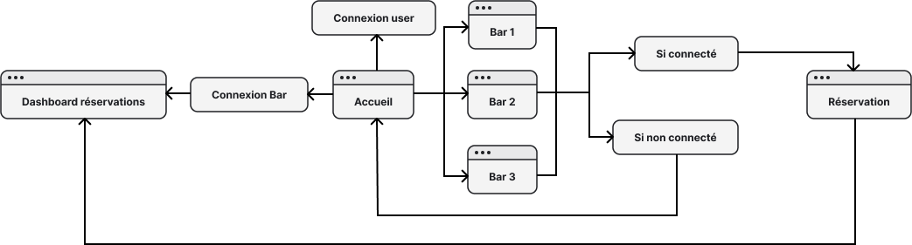

= Specification technique - Afterwork Home

:description: 
ifdef::env-vscode,env-gitlab[]
endif::[]
ifdef::env-site[]
include::partial$_attributes.adoc[]
endif::[]

[abstract]
{description}.
Pour toutes les informations fonctionnelles, veuillez consulter la spécification fonctionnelle du projet.

== Vue d'ensemble du projet

Le projet a pour objectif de créer un site web permettant aux utilisateurs de réserver une table dans des bars partenaires pour un afterwork, de consulter les bières disponibles et de vérifier si les bars environnants sont ouverts. Le site doit être accessible et convivial, avec une interface de connexion pour les utilisateurs et les bars.

== Prérequis

Le projet est développé en utilisant PHP et nécessite un serveur web (comme WampServer) et une base de données MySQL pour le stockage des données ainsi qu'un IDE comme VisualStudioCode pour le developpement du projet.

== Dépendances

Avant de procéder, assurez-vous que les dépendances suivantes sont installées :

* PHP >= 7.4
* MySQL

== Exigences du produit

=== Interface Utilisateur

L'interface utilisateur doit être basée sur une interface web avec les fonctionnalités suivantes :

* Page d'accueil présentant les différents bars.

* Menu de connexion situé à droite de la page et bouton de connexion pour les bars en haut à gauche.

* Logo en haut ou dans le footer qui permet de revenir à la page d'accueil.

=== Gestion des Utilisateurs

Les utilisateurs doivent pouvoir :

* Créer un compte et se connecter.

* Réserver une table dans les bars partenaires.

* Voir l'historique de leurs réservations sur la page de profil.

====
[,PHP]
Exemple de code pour la connexion des utilisateurs :
----
// Gestion de la connexion
if (isset($_POST['login'])) {
    $email = $_POST['login_email'];
    $password = $_POST['login_password'];

    $sql = "SELECT * FROM users WHERE email='$email'";
    $result = $conn->query($sql);

    if ($result->num_rows > 0) {
        $row = $result->fetch_assoc();
        // Vérifiez le mot de passe
        if (password_verify($password, $row['password_hash'])) {
            $_SESSION['user_id'] = $row['user_id']; // Enregistrez l'ID utilisateur dans la session
            $_SESSION['first_name'] = $row['first_name']; // Enregistrez le prénom dans la session
            header("Location: afterwork.php"); // Rediriger vers la même page
            exit();
----
====

=== Gestion des Bars 

Chaque bar doit avoir son propre compte et pouvoir accepter, refuser ou supprimer les réservations.

====
[,PHP]

----
<?php
    // Traitement de la validation, de l'annulation ou de la suppression de la réservation
    if ($_SERVER["REQUEST_METHOD"] == "POST") {
        $reservation_id = $_POST['reservation_id'];
        $action = $_POST['action'];

        if ($action == 'approve') {
            $update_sql = "UPDATE reservations SET status = 'Confirmed' WHERE reservation_id = ?";
        } else if ($action == 'cancel') {
            $update_sql = "UPDATE reservations SET status = 'Canceled' WHERE reservation_id = ?";
        } else if ($action == 'delete') {
            $update_sql = "DELETE FROM reservations WHERE reservation_id = ?";
        }

        $update_stmt = $conn->prepare($update_sql);
        $update_stmt->bind_param("i", $reservation_id);
        if ($update_stmt->execute()) {
            echo "Réservation mise à jour avec succès.";
            header("Refresh:0"); // Rafraîchir la page pour voir les changements
        } else {
            echo "Erreur lors de la mise à jour de la réservation : " . $update_stmt->error;
        }
        $update_stmt->close();
    }
    ?>
----
====

   

L'administrateur doit pouvoir ajouter ou supprimer un bar.

====
[,SQL]
Exemple de code pour ajouter un bar :
----

INSERT INTO bars (name, address, description) VALUES ('Le Peacock', '14 Pl. Rihour', 'Cette nouvelle maison lilloise joue sur une parfaite combinaison bar/restaurant pour recevoir habitués, passants du moment et voyageurs des quatre coins du monde dans une ambiance des plus conviviales.');
----
====

=== Gestion des Bières 

Les bières doivent être ajoutées à la base de données avec les informations suivantes :

* Nom
* Type
* Teneur en alcool
* Brasserie

====
[,SQL]
Exemple de code pour ajouter une bière :
----
INSERT INTO beers (bar_id, name, type, alcohol_content, brewery) VALUES (1, 'La Chouffe', 'Belgian Ale', 8.0, 'Brasserie d'Achouffe');

----
====

== Traitement des Réservations

Les réservations doivent être gérées par un système qui enregistre les détails de chaque réservation dans la base de données. 

====
[,PHP]
PHP pour enregistrer les informations d'une reservation
----
        <?php if (isset($_SESSION['user_id'])): ?>
            <form method="POST" action="profile.php" class="reservation-form">
                <input type="hidden" name="bar_id" value="<?php echo $bar_id; ?>">
                <label for="reservation_date">Date:</label>
                <input type="date" name="reservation_date" required>
                <label for="reservation_time">Heure:</label>
                <input type="time" name="reservation_time" required>
                <label for="number_of_people">Nombre de personnes:</label>
                <input type="number" name="number_of_people" required>
                <button type="submit">Réserver</button>
            </form>
        <?php else: ?>
            
Veuillez vous <a href="afterwork.php">connecter</a> pour faire une réservation.

        <?php endif; ?>

----
====

== Gestion des Horaires 

Les horaires d'ouverture des bars doivent être stockés dans la base de données et affichés sur le site.

====
[,SQL]
Exemple d'insertion :
----
INSERT INTO opening_hours (bar_id, day_of_week, open_time, close_time) VALUES (1, 'mercredi', '18:00', '01:00');
----
====

 

== Gestion des Erreurs

Le site doit comporter des mécanismes de gestion des erreurs pour informer les utilisateurs des problèmes rencontrés, par exemple, un mot de passe invalide ou une mauvaise addresse email.

====
[,SQL]
Exemple d'une erreur pour un mot de passe incorrect ou d'un compte inexistant
----
        } else {
            echo "Mot de passe incorrect.";
        }
    } else {
        echo "Aucun utilisateur trouvé avec cet email.";
    }
----
====

== Structure 

Le projet se divise en deux pointq principaux, le site web et la base de données

=== Site Web

=== Base de données

image::images/bdd.png[]

== Tests Unitaires, d'Intégration et Fonctionnels

Le projet doit inclure des tests unitaires pour vérifier la fonctionnalité de chaque module ainsi que des tests d'intégration pour valider l'interaction entre les différents composants.

== Documentation 

La documentation doit inclure des instructions d'installation, des directives d'utilisation et des exemples de fonctionnement.

== Considérations et Défis Potentiels

Assurer la sécurité des données utilisateur, notamment lors de la connexion, l'inscription et des réservations.

== Plateformes Supportées 

Le site doit être fonctionnel sur tous les principaux navigateurs web, y compris Chrome, Firefox, et Safari.

